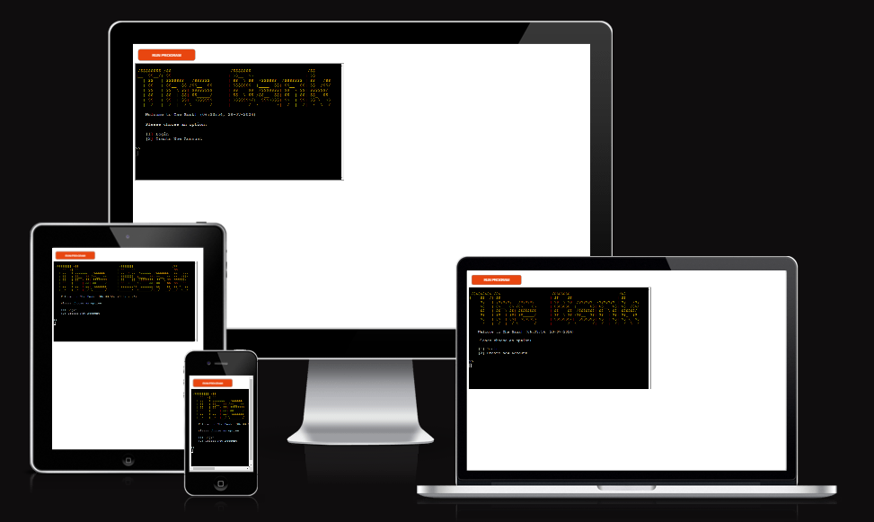

# The Bank
The Bank is an online banking application developed with Python which gives the user the ability to create an account, login to their account, deposit and withdraw from their balance, and see their account details.

  

## Table of contents:

<ol>
    <li>UX</li>
    <li>Features</li>
    <li>Technologies Used</li>
    <li>Testing</li>
    <li>Deployment</li>
    <li>Credits</li>
<ol>
