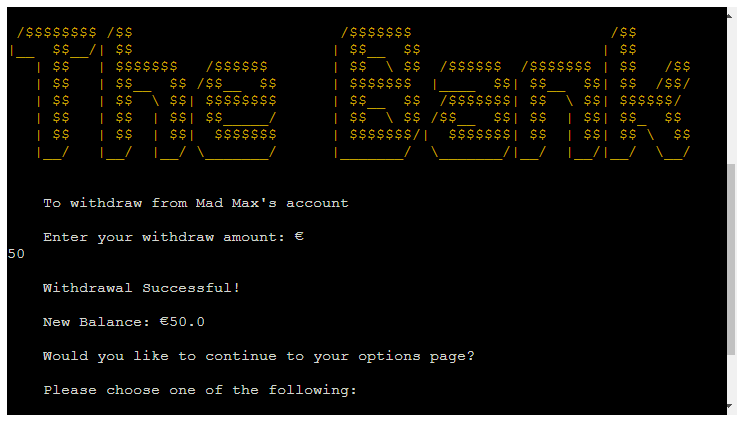

# The Bank
The Bank is an online banking application developed with Python which gives the user the ability to create an account, login to their account, deposit and withdraw from their balance, and see their account details.

  

## Table of contents:

<ol>
    <li>UX</li>
    <li>Features</li>
    <li>Technologies Used</li>
    <li>Testing</li>
    <li>Deployment</li>
    <li>Credits</li>
<ol>

## 1. UX

The users for The Bank application are:
- Anyone who wishes to interact with an online banking app
- People that wish to use a banking app built with Python

  

## 2. Features

The welcome page displays the logo for the application and two options for the user,
the first option is to login for existing account holders and the second option is 
to create a new account for new users.
- To create a new account the user needs to enter a username and an account number
and pin will be generated
- The login option is for returning users with accounts already set up, the user is
prompted for their username and pin and these are used to validate the users login 

  

  

  

- The options page gives the user a list of four options once logged in. Deposit, withdraw, show account
 details and exit.

  

- The deposit feature lets the user add to their balance

  

- The withdraw feature lets the user take away from their balance

  

- The account details feature allows the use to see all of their account data

  

- The exit option allows the user to exit options and return to welcome page

  

## 3. Technologies Used

- Python is the language that was used to develope this banking application
- Google sheets is used to store the user accounts data
- Github for storing code

## 4. Testing

- The Black python formatter was installed and used to format code
